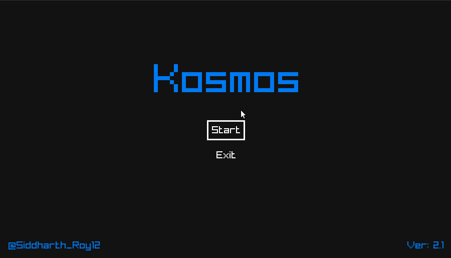

## Kosmos

A bullet-hell shooter game made in C99 for my college project.




## Building

### Linux

#### Install requied libraries

**Ubuntu**
```bash
sudo apt install libasound2-dev mesa-common-dev libx11-dev libxrandr-dev libxi-dev xorg-dev libgl1-mesa-dev libglu1-mesa-dev

```

#### Compiling
```bash
mkdir build

cd build

cmake ..

cmake --build .

./kosmos
```

#### Cross Compiling to Window
```bash
mkdir build

cd build

cmake -DBUILD_SHARED_LIBS=OFF  -DCMAKE_SYSTEM_NAME=Windows -DCMAKE_C_COMPILER=x86_64-w64-mingw32-gcc -DCMAKE_RC_COMPILER="$(which x86_64-w64-mingw32-windres)"  -DCMAKE_FIND_ROOT_PATH=/usr/x86_64-w64-mingw32 -DCMAKE_FIND_ROOT_PATH_MODE_INCLUDE=ONLY -DCMAKE_INSTALL_PREFIX=../install-win ..

make

wine kosmos.exe
```

### Window

Install cmake and a C compiler if you haven't already.

#### With MinGW
```bash
mkdir build

cd build

cmake .. -G "MinGW"

cmake --build .

# kosmos.exe should appear in the build folder
```